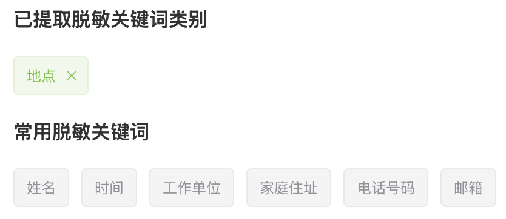
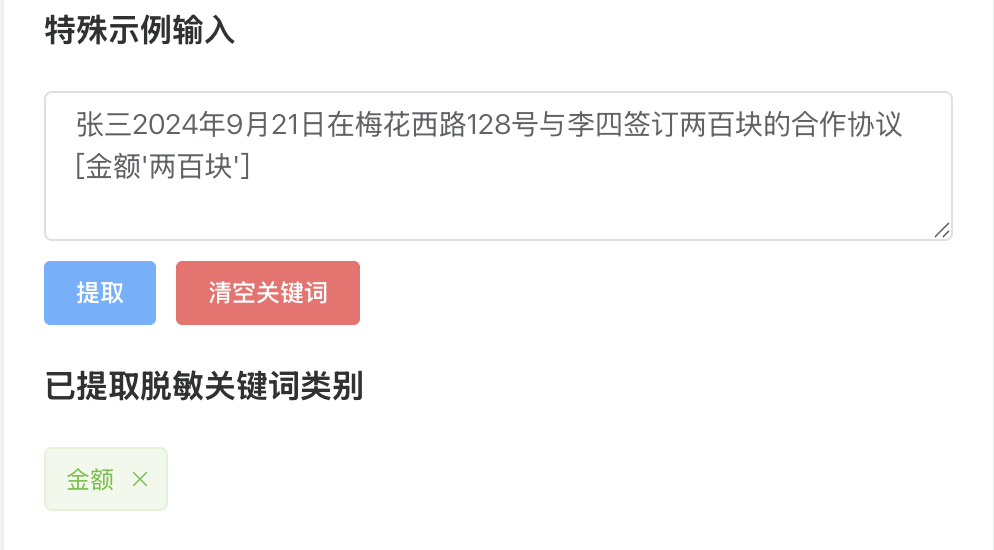
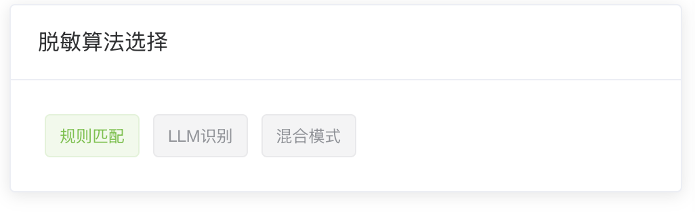

# How to use Vertical Domain Data Anonymization

## 1.将待脱敏文本准备为.txt格式的文本文件

```text
示例待处理文本：

2024年5月8日，上市公司大米集团市场部经理刘丽就大米集团在新能源汽车领域未来的发展与比克里能源有限公司总经理李海欣在海珠市喜来登大酒店进行会谈，双方会中达成合作共识，比克里能源有限公司将承担起大米集团整车制作过程中的关键能源技术支持和材料提供工作。会后双方前往位于海珠桂园区的大米集团新能源汽车研发总部进行参观，李海欣经理表示看好未来的发展前景
```

## 2.确认所需脱敏关键词类别

### 2.1.工具自带常用脱敏关键词可勾选




### 2.2.特定领域脱敏关键词按给定格式在示例中输入，工具会自动识别




 🌟🌟注意用户自定义关键词的识别格式

```text
格式示例：
  张三2024年9月21日在梅花西路128号与李四签订两百块的合作协议[金额'两百块']
```
上例中的“人物”“时间”“地点”均在常用关键词中给出，用户自定义“金额”关键词需使用[关键词‘在文本中出现的关键词’]格式给出


## 3.脱敏算法选择

根据实际需求进行脱敏算法的选择




```text
张三2024年9月21日在梅花西路128号与李四签订两百块的合作协议[金额'两百块']
```
#### 四级标题

